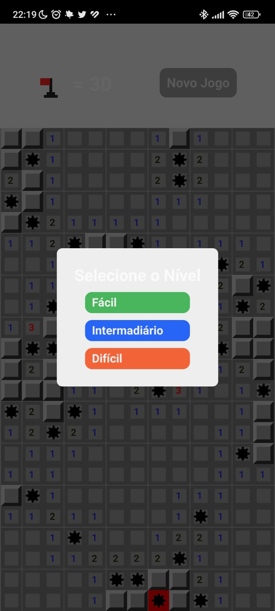
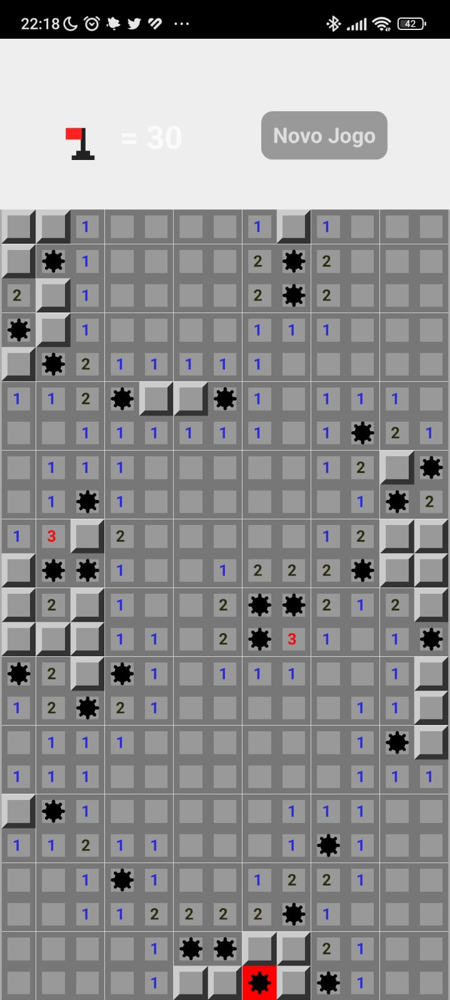
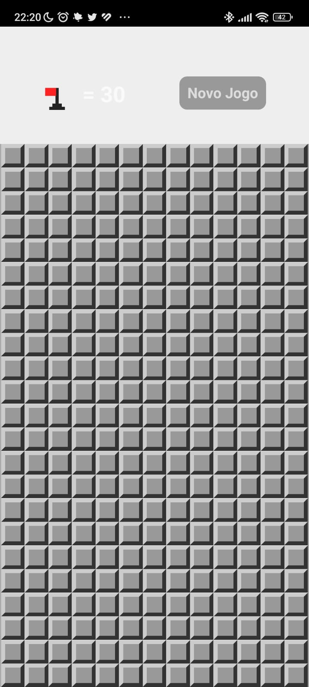

# Campo Minado React Native

Este é um novo projeto React Native, inicializado usando [`@react-native-community/cli`](https://github.com/react-native-community/cli).

Este é um novo projeto React Native para um aplicativo de Campo Minado. O objetivo deste projeto é praticar React Native, TypeScript e lógica de programação, além de trabalhar com o Android Studio e configurar o ambiente de desenvolvimento.





## Começando

> **Nota**: Certifique-se de ter concluído as instruções de [Configuração de Ambiente do React Native](https://reactnative.dev/docs/environment-setup) até o passo "Criando uma nova aplicação" antes de prosseguir.

### Passo 1: Instalação dos pacotes de dependencias

```bash
# usando npm
npm i

# OU usando Yarn
yarn i
```

### Passo 2: Inicie o Servidor Metro

Primeiro, você precisará iniciar o **Metro**, o _bundler_ JavaScript que acompanha o React Native.

Para iniciar o Metro, execute o seguinte comando a partir da _raiz_ do seu projeto React Native:

```bash
# usando npm
npm start

# OU usando Yarn
yarn start
```

### Passo 3: Inicie sua Aplicação

Deixe o Metro Bundler rodar em seu próprio terminal. Abra um novo terminal a partir da raiz do seu projeto React Native. Execute o seguinte comando para iniciar seu aplicativo Android ou iOS:

Para Android

```bash
# usando npm
npm run android

# OU usando Yarn
yarn android

```

Para construir o Android

```bash

$ cd android

# Criar apk de depuração:
./gradlew assembleDebug

# Criar versão de lançamento:
$ ./gradlew assembleRelease #O `apk` gerado estará localizado em `android/app/build/outputs/apk`


```

Para IOS

```bash
# usando npm
npm run ios

# OU usando Yarn
yarn ios
```

### Passo 4: Modificando seu Aplicativo

Agora que você executou e modificaou com sucesso o aplicativo, vamos fazer algumas modificações.

Abra App.tsx no seu editor de texto de preferência e edite algumas linhas.

Para Android: Pressione a tecla <kbd>R</kbd> duas vezes ou selecione "Recarregar" no Menu de Desenvolvedor (<kbd>Ctrl</kbd> + <kbd>M</kbd> (no Windows e Linux) ou <kbd>Cmd ⌘</kbd> + <kbd>M</kbd> (no macOS)) para ver suas alterações!

Para iOS: Pressione <kbd>Cmd ⌘</kbd> + <kbd>R</kbd> no seu Simulador iOS para recarregar o aplicativo e ver suas alterações!
